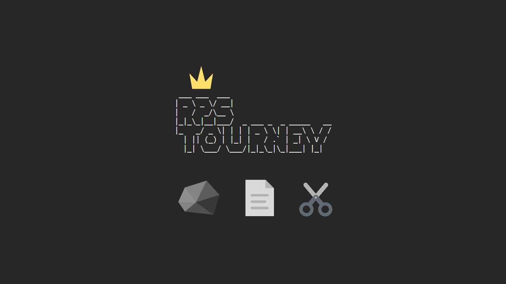
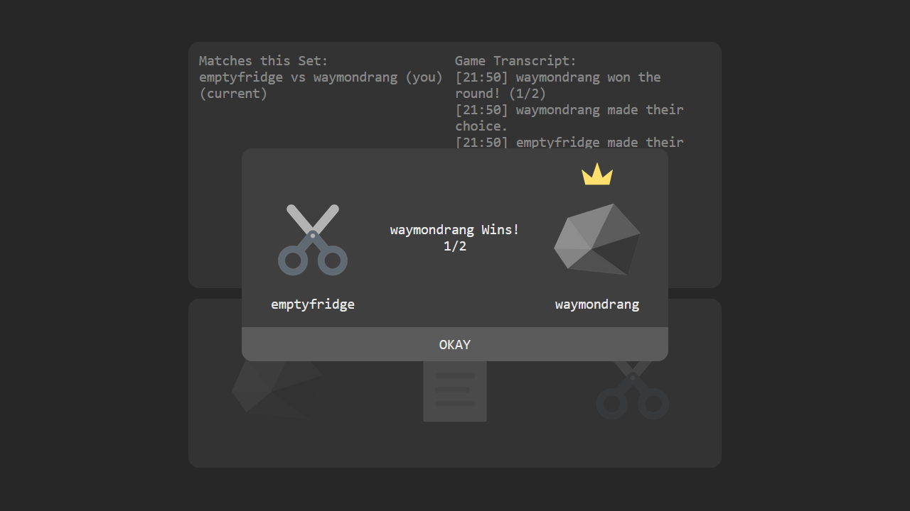
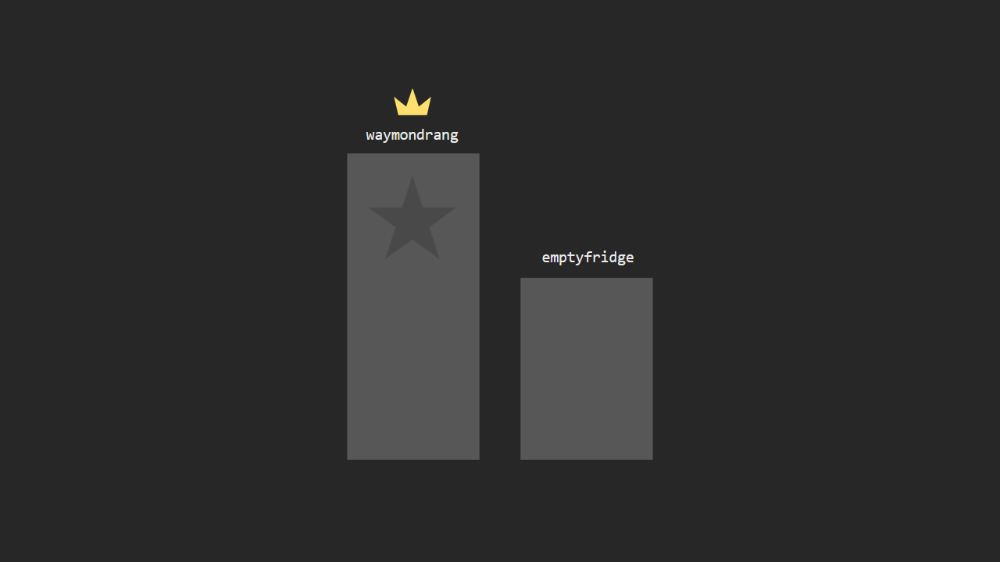
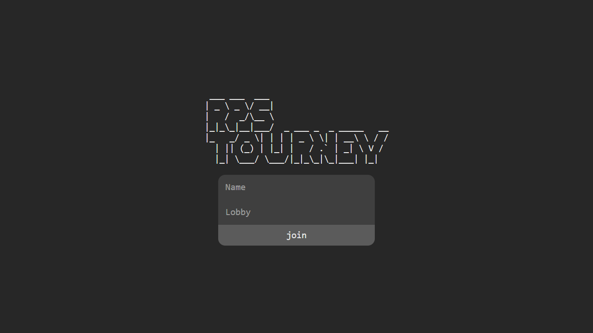

[**RPS Tourney**](https://tteok-rps.herokuapp.com/) is a minimal Rock Paper Scissors tournament web game, with a ReactJS client and an Express, Socket.js powered Node serverside, deployed on Heroku.

### Overview

The full stack application has a minimal interface, and is easy to use for all players. Creating or joining lobbies is as simple as entering a unique lobby name & lobby-unique name.

Once in a lobby, a tournament is started between players, with randomly created bracketing tiers that automatically scale based on the present number of players, odd or even. Players who win their best of 3, 1v1 game advance to the next set, until only 2 remain, the winner of which is decided in a best of 5.

### Previews

